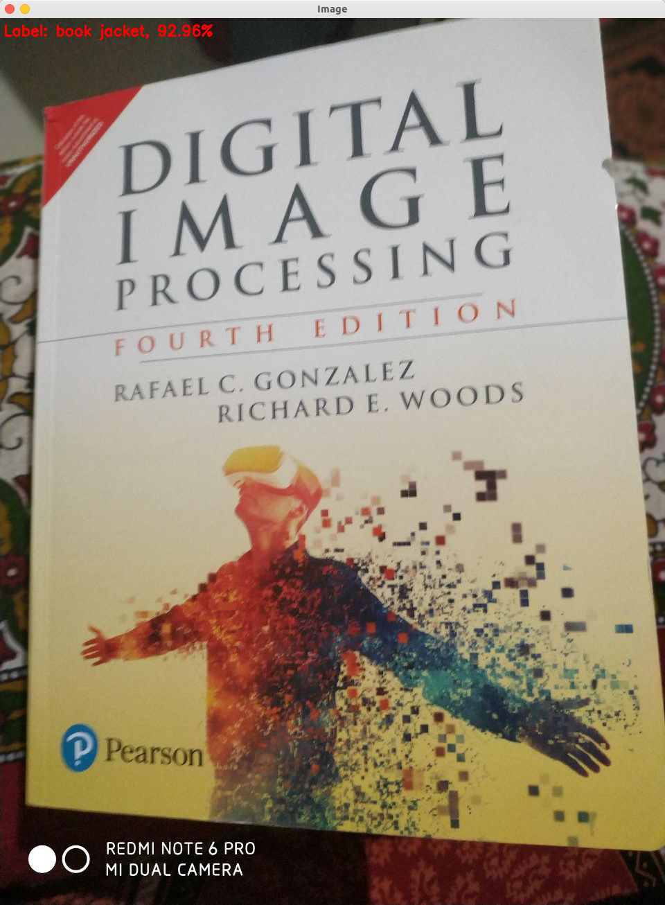
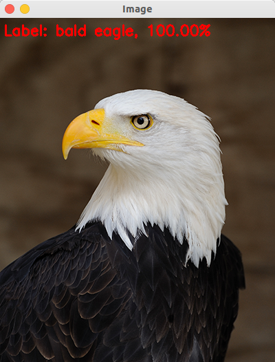

# DEEP LEARNING WITH OPENCV
### Using deep learning models with OpenCV

Make predictions with pre-trained deep learning model (GoogleLeNet) in Caffe using OpenCV

All thanks to Adrian Rosebrock (from [pyimagesearch](https://www.pyimagesearch.com/)) for making
great tutorials. This project is inspired from his blog: [Deep Learning with OpenCV](https://www.pyimagesearch.com/2017/08/21/deep-learning-with-opencv/).
I have included the author's code and the one I wrote my self as well.

## **Key Points**
1. Steps involved:
    1. Load the image from disk
    2. Load the Caffe model architecture and weights in OpenCV
    3. Make a forward pass and print the top-5 predictions
2. Assumptions:
    1. We already have the trained Caffe model.
    2. Our test image lies in the 1000 classes from ImageNet
3. The model is trained on ImageNet dataset that has 1000 classes.
4. With the release of OpenCV 3.3, the **dnn** module is not officially part of OpenCV. Before that it came in opencv_contrib from release 3.1.
5. **dnn** module supports a number of deep learning frameworks which includes Caffe, Tensorflow and Torch/PyTorch. Keras is **not** yet supported.
6. We cannot train a deep learning model with OpenCV but we can load pre-trained model and make predictions with it.
7. Popular network architectures compatible with OpenCV 3.3 include:
    1. GoogleLeNet
    2. AlexNet
    3. SqueezeNet
    4. VGGNet
    5. ResNet
8. **Aleksandr Rybnikov** is the main contributor of **dnn** module.
9. I created the python script that can be used to classify input images using OpenCV and GoogleLeNet (pre-trained on ImageNet) using the Caffe framework.
10. We need two files for Caffe network:
    1. prototxt file: defines the model architecture
    2. caffemodel file: stores the model weights
11. We show the top prediction on the image and prints the top-5 predictions on terminal.

 ## **Requirements: (with versions I tested on)**
 1. python          (3.7.3)
 2. opencv          (4.1.0)
 3. numpy           (1.61.4)

 ## **Commands to run the prediction:**
 ```
 python deep_learning_with_opencv_mine.py --image images/jemma.png --prototxt bvlc_googlenet.prototxt \
	--model bvlc_googlenet.caffemodel --labels synset_words.txt
```

## **Results:**
The results are pretty accurate. The model works well with OpenCV and gave very good prediction results.






## **Limitations**
None
